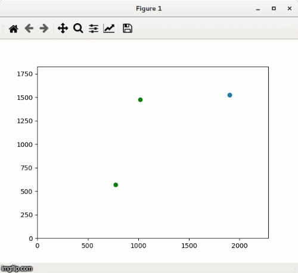

# Optimisation
A set of optimisation algorithms implementations for mono or multi objectives.

### Simulated annealing
Implementation of simulated annealing for multi objective discrete problems.
You can find the dataset [here](http://home.ku.edu.tr/~moolibrary/).



Usage :
```
python multi_objective_annealing.py
```

_______________________________________________________
Author : Thibault Charmet
Creation date : 01/2020
